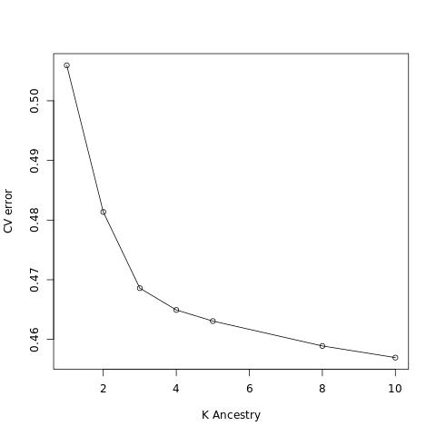
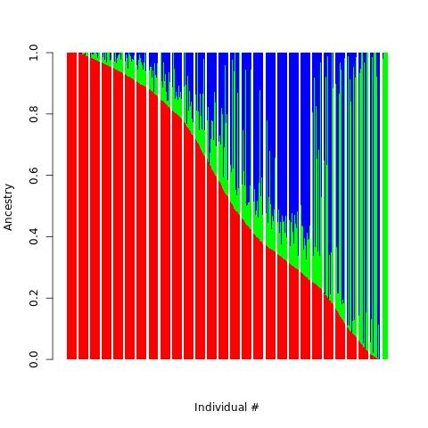

## Admixture analysis
Admixture analysis is a statistical method used in population genetics to estimate the proportions of ancestry in an individual's genome derived from multiple populations. By analyzing variations in DNA sequences, this method provides insights into historical migrations, inter-population mixing, and the genetic backgrounds of mixed populations. 

Species with breeds under artificial selection pressure like dogs can make use of admixture analysis in special situations including:

1.  ***Historical admixture:*** If there is suspicion or historical evidence that a particular breed was created through the mixing of two or more other breeds, admixture analysis can provide insights into the genetic contributions of each ancestral breed. The Golden Retriever breed has a well-documented origin, having been developed in the Scottish Highlands in the late 19th century from a blend of Yellow Retrievers, Tweed Water Spaniels and other breeds. Therefore, this situation does not seem applicable.
2.  ***Population bottlenecks and diversity:*** Admixture analysis can help determine if there has been a recent bottleneck (a sharp reduction in the size of a population) in the breed's history. Such events can lead to a decrease in genetic diversity, which can increase susceptibility to diseases. This would be a useful application if the population represented a wide array of Golden Retrievers from different lineages or regions, but this is not the case.
3.  ***Breed purity:*** Admixture analysis can be used to assess the genetic purity of individual dogs or lines within a breed. If there's unexpected genetic material from another breed, it might be indicative of undisclosed crossbreeding in the past. That seems like a useful application but the studied population would need to include samples from other breeds to identify any unusual genetic signals within the Golden Retriever dogs.
4.  ***Health and genetic disorders:*** Many pure-bred dogs are prone to specific genetic disorders. Golden Retrievers, like many pure-bred dogs, have specific health concerns, including hip dysplasia, certain cancers and eye issues. While admixture analysis doesn't directly target these, understanding the genetic makeup and potential sources of variation within a breed can help in broader genetic studies aimed at improving breed health. While health-focused studies can be breed-specific, knowing the genetic makeup of related breeds might help identify the origins of certain genetic disorders or traits.


In conclusion, for this analysis to be useful, a population of dogs including more breeds is needed. For now, the data of Golden retrievers only will be used to explore the genetic diversity within the breed. Hopefully, this dataset can be expanded soon to include more dogs from other breeds.     


## 1. Install
```
conda install -c bioconda admixture=1.3.0
```

## 2. Exclude 1st degree relatives
```
mkdir -p admix
# 0.177 (the geometric mean of 0.25 and 0.125) will be used as cutoff for the KING kinship coeffiecients to identify 1st degree relatives.
plink2 --bfile AxiomGT1v2.filtered.LD_prune --chr-set 38 no-xy --allow-extra-chr \
       --king-cutoff 0.177 \
       --out admix/AxiomGT1v2.1st_degree_relatives

# Let's remove those relatives to avoid inflation of false associations in the GWAS
plink2 --bfile AxiomGT1v2.filtered.LD_prune --chr-set 38 no-xy --allow-extra-chr \
       --remove admix/AxiomGT1v2.1st_degree_relatives.king.cutoff.out.id \
       --make-bed --output-chr 'chrM' --out admix/AxiomGT1v2.noRelatives.filtered.LD_prune
```


## 3. Remove non-autosomal markers and change character names to integers
```
plink2 --bfile admix/AxiomGT1v2.noRelatives.filtered.LD_prune --chr-set 38 no-xy --allow-extra-chr \
       --autosome \
       --make-bed -out admix/AxiomGT1v2.noRelatives.filtered.LD_prune.autosomes
```

## 4. Run Admixture in the cross-validation mode to find out the best number of ancestries
```
cd admix
for k in {1..10};do echo $k;
  admixture -j8 --cv AxiomGT1v2.noRelatives.filtered.LD_prune.autosomes.bed $k | tee log${k}.out
done
grep "^CV error" log*.out | cut -d":" -f1,3 | sed 's/log//;s/\.out://' | sort -k1,1n > admix_cv.txt

Rscript -e 'val <- read.table("admix_cv.txt");'\
'jpeg(file = "admix_cv.jpg");'\
'plot( x = val$V1, y = val$V2, type = "o",xlab = "K Ancestry", ylab = "CV error");'\
'dev.off();'
```

<!-- -->


There is an output file for each parameter set: Q (the ancestry fractions) and P (the allele frequencies of the inferred ancestral populations). 

## 5. Plot the Q estimates
```
sort -k1,3nr AxiomGT1v2.noRelatives.filtered.LD_prune.autosomes.3.Q > AxiomGT1v2.noRelatives.filtered.LD_prune.autosomes.3.Q.sorted
Rscript -e 'tbl=read.table("AxiomGT1v2.noRelatives.filtered.LD_prune.autosomes.3.Q.sorted");'\
'jpeg(file = "ancestries.jpg");'\
'barplot(t(as.matrix(tbl)), col=rainbow(3),xlab="Individual #", ylab="Ancestry", border=NA);'\
'dev.off();'
```

<!-- -->


## 6. Plot the Q estimates of a selected subset of individuals
```
tail -n+2 AxiomGT1v2.noRelatives.filtered.LD_prune.pca.eigenvec | awk '{if($3<0.02 && $4>0.03)print $1,$2}' > pc2_extreme
paste AxiomGT1v2.noRelatives.filtered.LD_prune.autosomes.3.Q  AxiomGT1v2.noRelatives.filtered.LD_prune.autosomes.fam | grep -wf pc2_extreme > pc2_extreme.Q
echo Population Percent Individual > subset_ancestry.txt
cat pc2_extreme.Q | awk '{for (a = 1; a <= 3; a++)print "Pop"a,$a,$4"."$5}' >> subset_ancestry.txt

Rscript -e 'data <- read.table("subset_ancestry.txt",header = TRUE);'\
'library(ggplot2);'\
'bar <- ggplot(data, aes(fill=Population, y=Percent, x=factor(Individual))) +'\
'geom_bar(position="stack", stat="identity") + ggtitle("Admixture ancestries");'\
'bar2 <- bar + theme(axis.text.x = element_text(angle = 90, vjust = 0.5, hjust=1, size = 4));'\
'ggsave("subset_ancestries.png", bar2, width = 12, height = 6, dpi = 400);'
```

<!-- -->

